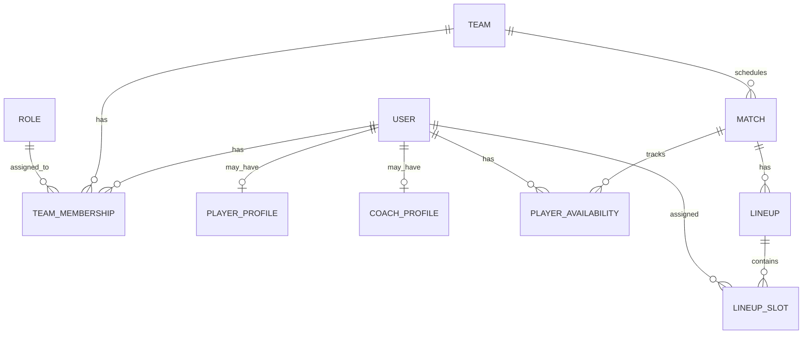

# Domain Model

## Status

Draft for Sprint 0 review.

## Purpose

This document defines the initial SquadSync domain model. The model is intentionally soccer-specific so the first implementation remains understandable, testable, and useful for the coach workflow.

## Modeling Strategy

The MVP uses explicit domain relationships.

The central modeling choice is:

```text
A User participates in a Team through a TeamMembership.
The TeamMembership carries the user's team role.
```

This keeps team participation, roster state, and authorization context easy to reason about.

## Core Concepts

### User

A person who can access or be represented in the system.

Examples:

- Coach
- Assistant coach
- Team manager
- Player
- Parent/guardian later

A `User` may have one or more soccer-related profiles depending on their role in the team context.

### Team

A soccer team managed in SquadSync.

A team owns roster, membership, matches, and lineups.

### TeamMembership

The relationship between a `User` and a `Team`.

This is the central relationship for roster and role management.

A membership can represent:

- Player membership
- Coach membership
- Assistant coach membership
- Manager membership
- Viewer membership later

### Role

A role describes what a user is allowed to do within a team context.

Initial role examples:

- Owner
- Coach
- AssistantCoach
- Manager
- Player
- Viewer

Authorization should stay simple at first. Add more granular permissions only when product behavior requires them.

### PlayerProfile

Soccer-specific player information associated with a user.

Potential fields:

- Display name
- Jersey number
- Preferred positions
- Dominant side
- Height
- Weight
- Player status
- Notes

The profile belongs to the person. Team-specific data belongs on the membership or roster context.

### CoachProfile

Soccer-specific coaching information associated with a user.

Potential fields:

- Coaching display name
- License/certification notes later
- Bio/notes later

For the MVP, this can stay minimal or be deferred.

### Match

A scheduled soccer match for a team.

Potential fields:

- Team
- Opponent name
- Scheduled date/time
- Location
- Status
- Notes

### Formation

A named soccer formation used for lineup planning.

Examples:

- 4-3-3
- 4-4-2
- 3-5-2
- 7v7 or 9v9 formations later if desired

The first MVP may store formations as controlled values before introducing a configurable formation model.

### Lineup

A lineup plan for a match.

A lineup belongs to a match and contains lineup slots.

### LineupSlot

A specific assignment within a lineup.

Potential fields:

- Lineup
- Position
- Assigned player
- Period/segment later
- Notes

### PlayerAvailability

A player's availability for a match.

Potential values:

- Available
- Unavailable
- Injured
- Late
- Unknown

## Initial Relationship Diagram



## Suggested Initial Entities

```text
User
Team
TeamMembership
Role
PlayerProfile
CoachProfile
Match
PlayerAvailability
Formation
Lineup
LineupSlot
```

## Soccer Position Modeling

The MVP can begin with a simple position enum or value object.

Examples:

- GK
- CB
- LB
- RB
- CDM
- CM
- CAM
- LW
- RW
- ST

Do not overbuild the position model early. Formation-specific slot modeling can evolve after manual lineup building works.

## Membership Versus Profile

Use this distinction:

- `User`: person identity
- `PlayerProfile`: soccer player attributes about the person
- `TeamMembership`: the person's relationship to a team
- `Role`: what the person can do in that team context

Example:

A person can be a player on one team and an assistant coach on another. That should be represented as two memberships, not two different users.

## Integration Boundary Concepts

### LineupSuggestionRequest

A contract that packages enough match, roster, formation, and constraint data for an external service to suggest a lineup.

### LineupSuggestionResponse

A response containing suggested player-slot assignments and a high-level planning summary.

The request and response belong to the platform integration boundary. The algorithm/service implementation belongs to the separate lineup assistance service.

## Design Principle

The model should be understandable to a soccer coach, a software engineer, and a hiring reviewer. If a concept requires a long explanation, it probably does not belong in the first MVP.
