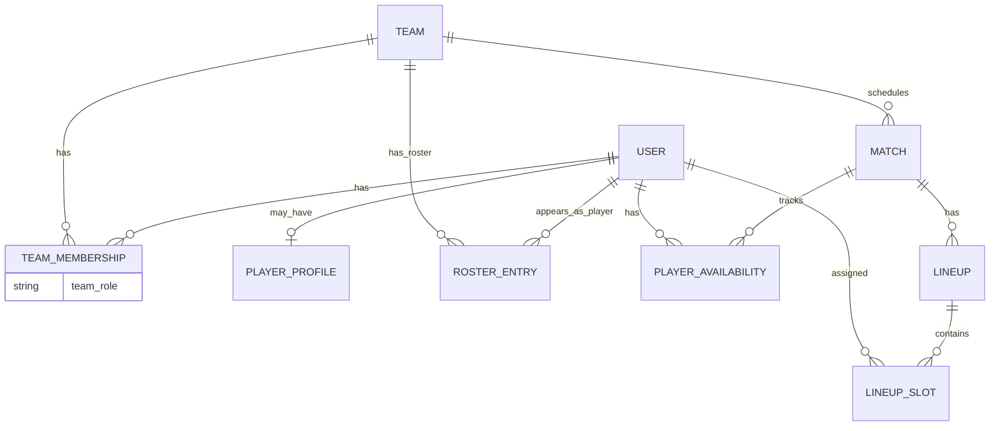

# Domain Model

## Status

Active. This document is the current domain-model baseline.

## Purpose

This document defines the initial SquadSync domain model. The model is intentionally soccer-specific so the first implementation remains understandable, testable, and useful for the coach workflow.

## Modeling Strategy

The MVP uses explicit domain relationships:

```text
A represented User participates in a Team through a TeamMembership.
The TeamMembership carries one constrained TeamRole.
```

`User` represents a person in SquadSync's domain. It is distinct from a future authentication account or external login identity. Authentication/account identity remains a future concern. The future access model may allow one account to act for more than one represented user, for example a parent or guardian acting for a youth player. This possibility does not define or implement account linking or delegation behavior in the MVP.

## Core Concepts

### User

A represented person in the domain, such as a coach, assistant coach, team manager, or player. A person's participation in each team is modeled by a separate `TeamMembership`.

`User` is not an authentication account. Account identity and authentication are deferred; an account may eventually be associated with or act for multiple represented users.

### Team

A soccer team managed in SquadSync. A team owns memberships, roster entries, matches, and lineups.

### TeamMembership

The relationship between a `User` and a `Team`. It records the person's team participation and has exactly one `TeamRole` in the MVP. A person may have memberships on multiple teams and may have different roles on each.

### TeamRole

A constrained MVP value on `TeamMembership`, such as Owner, Coach, AssistantCoach, Manager, Player, or Viewer. It is not a persisted, dynamically configurable Role/Permission entity model. Keep authorization simple; introduce more granular permissions only when concrete product behavior requires them and an approved design defines them.

### PlayerProfile

Person-level soccer attributes associated with a `User`, such as preferred positions, dominant side, height, and weight. It does not own team-context data such as jersey number or roster status.

### RosterEntry

The planned team-context record for a player on a team's roster. It connects a player's `User` to a `Team` and is the home for player-only roster data such as jersey number and roster status. It is distinct from the general `TeamMembership` relationship and `PlayerProfile` attributes.

### CoachProfile

Deferred. A dedicated coach profile is not needed for the initial model; add it only if a concrete MVP use case requires coaching-specific person attributes.

### Statistics

Deferred to later dedicated models. Do not add statistics fields to `PlayerProfile` or `RosterEntry` as a shortcut.

### Match

A scheduled soccer match for a team. Potential fields include opponent name, scheduled date/time, location, status, and notes.

### Formation

A named soccer formation used for lineup planning, such as 4-3-3, 4-4-2, or 3-5-2. The first MVP may store formations as controlled values before introducing a configurable formation model.

### Lineup

A lineup plan for a match. A lineup belongs to a match and contains lineup slots.

### LineupSlot

A specific assignment within a lineup, including position and assigned player. Period/segment and notes may be added when needed.

### PlayerAvailability

A player's availability for a match, with values such as Available, Unavailable, Injured, Late, or Unknown.

## Initial Relationship Diagram


```mermaid
erDiagram
    USER ||--o{ TEAM_MEMBERSHIP : has
    TEAM ||--o{ TEAM_MEMBERSHIP : has
    TEAM_MEMBERSHIP {
        string team_role
    }
    USER ||--o| PLAYER_PROFILE : may_have
    USER ||--o{ ROSTER_ENTRY : appears_as_player
    TEAM ||--o{ ROSTER_ENTRY : has_roster
    TEAM ||--o{ MATCH : schedules
    MATCH ||--o{ PLAYER_AVAILABILITY : tracks
    USER ||--o{ PLAYER_AVAILABILITY : has
    MATCH ||--o{ LINEUP : has
    LINEUP ||--o{ LINEUP_SLOT : contains
    USER ||--o{ LINEUP_SLOT : assigned
```

The diagram shows domain relationships, not authentication-account relationships. `TeamRole` is a constrained value carried by membership, not a separately managed role catalog.

## Suggested Initial Entities and Values

```text
User
Team
TeamMembership (with one TeamRole value)
PlayerProfile
RosterEntry
Match
PlayerAvailability
Formation
Lineup
LineupSlot
```

`CoachProfile`, statistics models, and authentication/account models are deferred. `TeamRole` is a constrained value and does not imply a persisted `Role` entity.

## Soccer Position Modeling

The MVP can begin with a simple position enum or value object.

Examples:

- GK
- CB
- LB
- RB
- CDM
- CM
- CAM
- LW
- RW
- ST

Do not overbuild the position model early. Formation-specific slot modeling can evolve after manual lineup building works.

## Membership, Roster, and Profile

Use these distinctions:

- `User`: represented person, separate from future authentication/account identity
- `TeamMembership`: the person's team relationship and one constrained `TeamRole`
- `PlayerProfile`: soccer attributes about the person
- `RosterEntry`: player-only team-context data, including jersey number and roster status

A person may be a player on one team and an assistant coach on another. Represent that with one `User` and separate memberships. A roster entry carries the player-specific team context; it does not turn `PlayerProfile` into team data.

## Integration Boundary Concepts

### LineupSuggestionRequest

A contract that packages enough match, roster, formation, and constraint data for an external service to suggest a lineup.

### LineupSuggestionResponse

A response containing suggested player-slot assignments and a high-level planning summary.

The request and response belong to the platform integration boundary. The algorithm/service implementation belongs to the separate lineup assistance service.

## Design Principle

The model should be understandable to a soccer coach, a software engineer, and a hiring reviewer. If a concept requires a long explanation, it probably does not belong in the first MVP.
