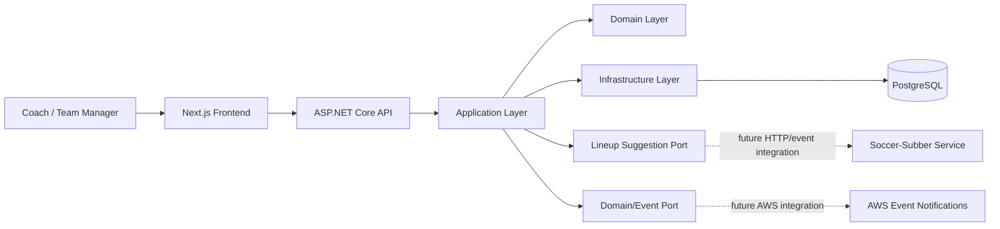
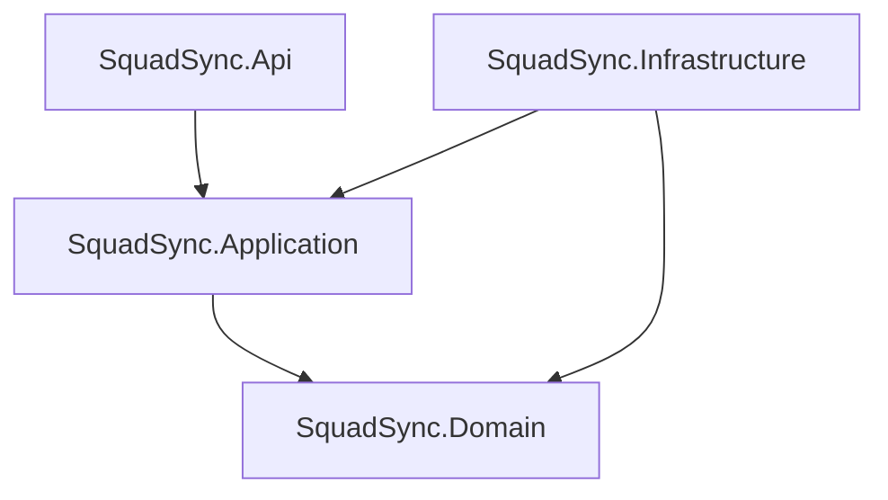

# System Overview

## Status

Draft for Sprint 0 review.

## Purpose

This document describes the intended public architecture for SquadSync. It gives future contributors and AI coding agents a stable map before application code is generated.

## Architecture Summary

SquadSync will be built as a modular monorepo containing a backend API, frontend dashboard, infrastructure artifacts, and project documentation.

The core platform is a modular monolith. External capabilities, such as lineup optimization and cloud notifications, are integrated through explicit service boundaries rather than embedded directly into the platform core.



## Repository Layout

Planned layout:

```text
squadsync/
  backend/
    src/
      SquadSync.Api/
      SquadSync.Application/
      SquadSync.Domain/
      SquadSync.Infrastructure/
    tests/
      SquadSync.UnitTests/
      SquadSync.IntegrationTests/
  frontend/
    src/
      app/
      components/
      features/
      lib/
      services/
      types/
  infra/
    docker/
    aws/
  docs/
    architecture/
    planning/
    adr/
    diagrams/
    agent-workflows/
    prompt-library/
  .github/
    workflows/
    instructions/
```

## Backend Architecture

The backend should use a modular ASP.NET Core structure with clear dependency direction.



### SquadSync.Api

Responsibilities:

- HTTP endpoints/controllers
- Request/response contracts
- Authentication and authorization wiring later
- OpenAPI/Swagger configuration
- Dependency injection composition root
- Health checks
- API-specific middleware

The API layer should stay thin. It should call application use cases rather than contain business logic.

### SquadSync.Application

Responsibilities:

- Use cases/application services
- DTO orchestration
- Validation coordination
- Interfaces for persistence and external services
- Transaction boundaries
- Application-level authorization checks later

The application layer coordinates behavior but should not contain infrastructure details.

### SquadSync.Domain

Responsibilities:

- Domain entities
- Value objects
- Enums
- Domain rules
- Domain events, once needed

The domain layer should be independent of ASP.NET Core, EF Core, external APIs, and infrastructure packages.

### SquadSync.Infrastructure

Responsibilities:

- EF Core DbContext and entity configuration
- Repository/query implementations if used
- External service clients
- Logging sinks and infrastructure adapters
- Outbox/event persistence later

Infrastructure implements interfaces defined by the application layer.

## Frontend Architecture

The frontend should be a Next.js + TypeScript application organized by feature.

Primary feature areas:

- Teams
- Players
- Matches
- Lineups
- Soccer-subber integration status/results later

Frontend principles:

- Keep server-state access in typed service modules
- Use TanStack Query for API data fetching/mutations
- Use local state for local UI concerns
- Avoid premature global state frameworks
- Keep UI copy public-safe and soccer-specific

## Data Architecture

PostgreSQL is the public target database. The first local version may run through Docker Compose and later connect to a private hosted local server or cloud-managed database.

The initial persistence model should support:

- Users
- Teams
- TeamMemberships
- Roles
- PlayerProfiles
- CoachProfiles
- Matches
- Formations
- Lineups
- LineupSlots
- PlayerAvailability

## Service Boundaries

### Soccer-Subber Boundary

The core platform should define an interface/port for lineup suggestions. The separate `soccer-subber` service can later implement the real optimization behavior.

The public SquadSync repository may contain:

- DTOs for request/response contracts
- Mock implementation
- HTTP client adapter later
- Failure handling rules
- Public-safe explanation summary placeholder

The public SquadSync repository must not contain the proprietary optimization internals.

### Event Notification Boundary

The core platform should eventually emit domain/application events. A later AWS notification capability can subscribe to or process these events.

Candidate events:

- `TeamCreated`
- `PlayerAddedToRoster`
- `PlayerAvailabilityChanged`
- `MatchScheduled`
- `LineupCreated`
- `LineupPublished`

Initial implementation can log or persist events locally before AWS services are introduced.

## Local Development Direction

Early local development should support:

- Docker Compose for PostgreSQL
- API running locally
- Frontend running locally
- Swagger available for backend testing
- Seed data for demo workflows

## Cloud Direction

AWS integration should be layered in after the core vertical slice is useful.

Potential path:

1. Containerize backend
2. Host database or use managed database
3. Deploy frontend
4. Add event outbox pattern
5. Add AWS notification pipeline
6. Integrate soccer-subber as a serverless/containerized service
7. Add AI-generated public-safe summary capability

## Architectural Principle

Build the public MVP as a clear, soccer-specific product. Keep extension points visible, but do not expose the broader private platform strategy.
